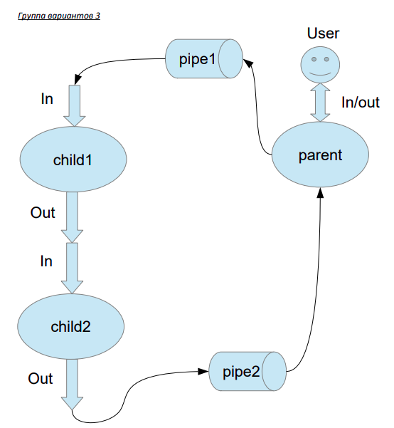

# Лабораторная работа №1


## Группа вариантов 3:


Родительский процесс создает два дочерних процесса. Перенаправление стандартных потоков
ввода-вывода показано на картинке выше. Child1 и Child2 можно «соединить» между собой
дополнительным каналом. Родительский и дочерний процесс должны быть представлены
разными программами.
Родительский процесс принимает от пользователя строки произвольной длины и пересылает их в
pipe1. Процесс child1 и child2 производят работу над строками. Child2 пересылает результат своей
работы родительскому процессу. Родительский процесс полученный результат выводит в
стандартный поток вывода.

## Задание:
#### Вариант 11
Child1 переводит строки в верхний регистр. Child2 превращает все пробельные
символы в символ «_».

## Запуск лабораторной:

```bash
gcc child.c -o child
gcc client.c -o client
./client

# если хочется отдельно протестировать функции 
./child1 
./child2 
```