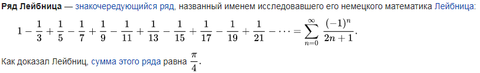
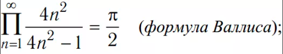

# Лабораторная работа №4

## Задание:
Требуется создать динамические библиотеки, которые реализуют
заданный вариантом функционал. Далее использовать данные
библиотеки 2-мя способами:
1. Во время компиляции (на этапе линковки/linking)
2. Во время исполнения программы. Библиотеки загружаются в
память с помощью интерфейса ОС для работы с динамическими
библиотеками

В конечном итоге, в лабораторной работе необходимо получить
следующие части:

● Динамические библиотеки, реализующие контракты, которые
заданы вариантом;

● Тестовая программа (программа №1), которая используют одну из
библиотек, используя информацию полученные на этапе
компиляции;

● Тестовая программа (программа №2), которая загружает
библиотеки, используя только их относительные пути и контракты.
Провести анализ двух типов использования библиотек. Пользовательский ввод для обоих программ должен быть организован
следующим образом:

● Если пользователь вводит команду «0», то программа переключает одну реализацию контрактов на другую (необходимо только для программы
№2). Можно реализовать лабораторную работу без данной функции, но
максимальная оценка в этом случае будет «хорошо»;

● “1 arg1 arg2 … argN”, где после “1” идут аргументы для первой функции, предусмотренной контрактами. После ввода команды происходит вызов
первой функции, и на экране появляется результат ее выполнения;

● “2 arg1 arg2 … argM”, где после “2” идут аргументы для второй функции,
предусмотренной контрактами. После ввода команды происходит вызов
второй функции, и на экране появляется результат ее выполнения.

### Вариант 17

Подсчёт количества простых чисел на отрезке [a, b] (a, b –
натуральные):

Сигнатура функции: 
int prime_count(int a, int b);

● Реализация №1: Наивный алгоритм. Проверить делимость
текущего числа на все предыдущие числа.

● Реализация №2: Решето Эратосфена

Расчет значения числа π при заданной длине ряда (k):

Сигнатура функции: float pi(int k);

● Реализация №1: Ряд Лейбница

● Реализация №2: Формула Валлиса

#### Ряд Лейбница



#### Формула Валлиса



## Запуск лабораторной:

```bash
gcc -shared -fPIC lib1.c -o libmy1.so
gcc -shared -fPIC lib2.c -o libmy2.so
gcc static_part.c -L. -lmy1 -o static
gcc dynamic_part.c -ldl -o dynamic

LD_LIBRARY_PATH=. ./static # для запуска статик версии
./dynamic # для запуска динамической версии

LD_LIBRARY_PATH=. ldd static # для проверки линковки библиотеки
```